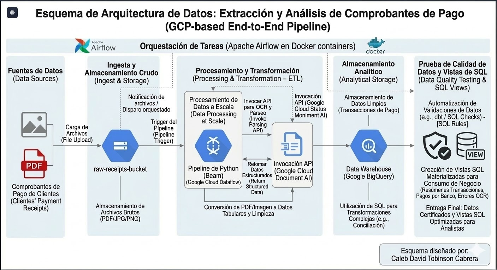
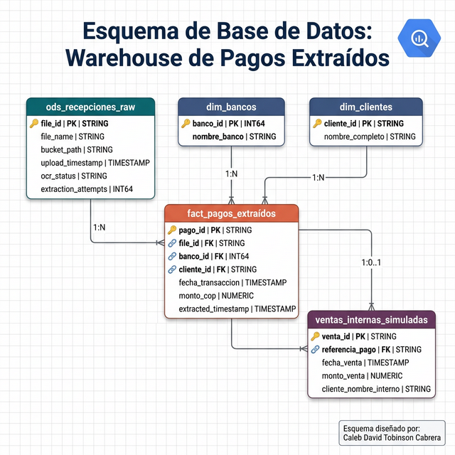

# 🏦 GCP Data Pipeline — Extracción y Análisis de Comprobantes de Pago

> **Pipeline end-to-end en Google Cloud Platform** que extrae, transforma y carga automáticamente datos estructurados desde imágenes de comprobantes bancarios (Nequi, Bancolombia, Davivienda) hacia BigQuery para análisis y visualización.

---

## 📌 Objetivo del Proyecto

Este proyecto demuestra la implementación de un **pipeline moderno de ingeniería de datos** capaz de procesar documentos financieros no estructurados (imágenes PNG/JPG de comprobantes de pago) y convertirlos en datos limpios y analíticos almacenados en un **Data Warehouse en Google BigQuery**.

El caso de uso es real y frecuente en el sector financiero colombiano: empresas y personas que necesitan **conciliar, auditar y analizar** transferencias realizadas a través de múltiples entidades bancarias, sin depender de integraciones directas con las APIs de los bancos.

---

## 🏗️ Arquitectura del Pipeline



El pipeline sigue una arquitectura **GCP-native end-to-end** con 4 fases principales:

| Fase | Componente | Tecnología |
|------|-----------|------------|
| **1. Ingesta** | Carga de imágenes al bucket RAW | Google Cloud Storage |
| **2. ETL / OCR** | Extracción de texto + parseo regex | Google Cloud Document AI |
| **3. Almacenamiento** | Carga de datos limpios | Google BigQuery |
| **4. Orquestación** | Scheduling y monitoreo | Apache Airflow (Docker) |

---

## 🔄 Flujo de Datos Detallado

```
Comprobantes (PNG/JPG)
        │
        ▼
┌─────────────────────┐
│  Cloud Storage RAW  │  ← gs://gcs-project-comprobante/raw_receipts/
│  (ingesta_gcs.py)   │
└────────┬────────────┘
         │
         ▼
┌─────────────────────────────┐
│  Google Cloud Document AI   │  ← OCR + extracción de texto
│  (procesamiento_etl.py)     │
│                             │
│  Regex Parser:              │
│  ├─ banco_destino           │
│  ├─ monto_transferido       │
│  ├─ fecha                   │
│  ├─ numero_referencia       │
│  └─ enviado_por             │
└────────┬────────────────────┘
         │  CSV en memoria (BytesIO)
         ▼
┌─────────────────────────────┐
│  Cloud Storage PROCESADO    │  ← gs://gcs-comprobantes-procesados/
└────────┬────────────────────┘
         │
         ▼
┌─────────────────────────────┐
│  Google BigQuery            │  ← comprobantes_dataset.transacciones_comprobantes
│  (carga_bq.py)              │
└─────────────────────────────┘
```

---

## 🚀 Orquestación con Apache Airflow

El pipeline completo es orquestado mediante un **DAG de Apache Airflow** (`pipeline_comprobantes_gcp`) que ejecuta las 3 fases en secuencia con reintentos automáticos.


```
ingesta_gcs → etl_document_ai → carga_bigquery
  ✅ success     ✅ success        ✅ success
```

Airflow corre en contenedores **Docker** con PostgreSQL como backend, lo que garantiza:
- 📆 Scheduling configurable (`@daily`, cron, o manual)
- 🔁 Reintentos automáticos por tarea
- 📊 Monitoreo visual del estado de cada ejecución
- 📋 Logs centralizados por tarea

---

## 🗄️ Esquema de Base de Datos (BigQuery)



El esquema sigue un **modelo híbrido ODS + Star Schema** adecuado para BigQuery:

| Tabla | Tipo | Descripción |
|-------|------|-------------|
| `ods_recepciones_raw` | ODS | Trazabilidad de archivos ingestados |
| `dim_bancos` | Dimensión | Catálogo de entidades bancarias |
| `dim_clientes` | Dimensión | Remitentes extraídos por regex |
| `fact_pagos_extraídos` | Hechos | Transacciones limpias y estructuradas |
| `ventas_internas_simuladas` | Conciliación | Cruce con sistema interno |

---

## 🏦 Comprobantes Soportados

El pipeline detecta y parsea automáticamente los siguientes formatos:

| Banco | Estilo | Campos clave extraídos |
|-------|--------|------------------------|
| **Nequi App** | Dark mode (Bancolombia) | Comprobante No., Valor, Producto destino/origen |
| **Nequi Recibo** | Papel / comprobante físico | Para, ¿Cuánto?, Referencia, Fecha |
| **Davivienda** | App oficial (header rojo) | Cuenta destino, Monto, Número de aprobación |

---

## 📊 Métricas Analíticas (BigQuery)

Las queries documentadas en `analisis_bigquery/` permiten calcular:

- 💵 **Monto total y promedio** transferido por período
- 🏆 **Ranking de bancos** por volumen de transacciones
- 📈 **Tendencia temporal** de pagos
- 🍩 **Participación %** de cada entidad bancaria
- ✅ **Calidad de datos**: % de campos completos vs incompletos
- 🔍 **Distribución por rangos** de monto

---

## 📁 Estructura del Proyecto

```
gcp-project-data-engineer-comprobante-de-pagos/
│
├── ingesta/
│   └── ingesta_gcs.py              # Fase 1: Subida a Cloud Storage
│
├── transformacion_etl/
│   └── procesamiento_etl.py        # Fase 2: OCR con Document AI + regex parser
│
├── carga_bigquery/
│   └── carga_bq.py                 # Fase 3: Carga a BigQuery
│
├── orquestador/
│   ├── dags/
│   │   └── pipeline_dag.py         # DAG de Apache Airflow
│   ├── pipeline_orquestador.py     # Orquestador Python alternativo
│   └── setup_airflow.ps1           # Script configuración Airflow
│
├── generador_de_comprobantes/
│   └── generador_comprobantes_reales.py  # Generador de datos sintéticos
│
├── analisis_bigquery/
│   ├── 01_kpis_generales.sql
│   ├── 02_analisis_por_banco.sql
│   ├── 03_analisis_temporal.sql
│   ├── 04_distribucion_montos.sql
│   ├── 05_calidad_datos.sql
│   ├── 06_vista_dashboard.sql
│   └── erd_warehouse_pagos.png
│
├── img/
│   ├── esquema_final.jpg           # Diagrama de arquitectura 
│   └── Captura de pantalla...png  # DAG Airflow en ejecución
│
├── Dockerfile                      # Imagen personalizada de Airflow
├── docker-compose.yaml             # Stack completo: Airflow + PostgreSQL
├── requirements.txt                # Dependencias Python
├── limpiar_bucket.py               # Utilidad: limpiar bucket RAW
└── .gitignore
```

---

## ⚙️ Configuración y Ejecución

### Pre-requisitos
- Python 3.11+
- Google Cloud SDK
- Docker Desktop
- Cuenta de servicio GCP con roles:
  - `Cloud Document AI API User`
  - `Storage Object Admin`
  - `BigQuery Data Editor`
  - `BigQuery Job User`

### Variables de entorno
```powershell
# CMD
set GOOGLE_APPLICATION_CREDENTIALS=json_key.json

# PowerShell
$env:GOOGLE_APPLICATION_CREDENTIALS = "json_key.json"
```

### Ejecución manual (sin Airflow)
```powershell
# Fase 1 — Ingesta
python ingesta\ingesta_gcs.py

# Fase 2 — ETL con Document AI
python transformacion_etl\procesamiento_etl.py

# Fase 3 — Carga a BigQuery
python carga_bigquery\carga_bq.py
```

### Ejecución con Airflow (Docker)
```bash
# Levantar el stack
docker-compose up -d

# Acceder a la UI
# http://localhost:8080  (admin / admin)
```

---

## 🛠️ Tecnologías Utilizadas

| Tecnología | Uso |
|-----------|-----|
|  | Almacenamiento raw y procesado |
|  | OCR y extracción de texto |
|  | Data Warehouse analítico |
|  | Orquestación del pipeline |
|  | Contenedores de Airflow |
|  | Lógica del pipeline |
|  | Transformación de datos |

---

## 📈 Decisiones de Diseño

- **Document AI sobre Tesseract**: Mayor precisión en documentos reales, sin instalación local, escalable en GCP.
- **Procesamiento en memoria**: Lectura y escritura directa GCS ↔ RAM sin tocar el disco local (`io.BytesIO`).
- **Regex multi-formato**: El parser detecta automáticamente el tipo de comprobante y aplica los patrones correspondientes.
- **WRITE_TRUNCATE**: Cada ejecución del pipeline reemplaza la tabla BigQuery para garantizar idempotencia.
- **Airflow en Docker**: Permite reproducibilidad completa del entorno de orquestación sin dependencias del sistema host.

---

## 👤 Autor

**Caleb David Tobinson Cabrera**  
Data Engineer | GCP Enthusiast

*Proyecto desarrollado como parte del portafolio de ingeniería de datos con enfoque en pipelines cloud-native.*
